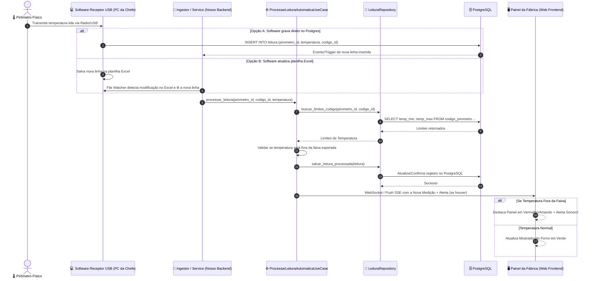

# 📐 Requisitos Funcionais, Não-Funcionais e Diagramas de Arquitetura (Coleta Automática)

Este documento especifica os Requisitos Funcionais (RFs), Requisitos Não-Funcionais (RNFs), Diagramas de Casos de Uso e Diagramas de Sequência do sistema **Forno Fundição**, atualizado para o modelo de **coleta automática via software do receptor USB**.

---

## 🎯 1. Requisitos Funcionais (RFs)

### 📋 Módulo de Ingestão e Equipamentos
*   **RF-01: Cadastro de Pirômetros**: O sistema deve permitir o cadastro e gerenciamento de pirômetros industriais (ex: PIR-01 a PIR-04), vinculando-os ao seu setor, material alvo (ex: SAE 1045, Ferro Nodular), processo e tipo de molde.
*   **RF-02: Tabela de Códigos por Equipamento**: O sistema deve permitir associar uma tabela de códigos numéricos (0 a 99) a cada pirômetro específico, definindo para cada código o nome da etapa, descrição, ordenação e faixas de temperatura esperadas (`temp_min_esperada` e `temp_max_esperada`).
*   **RF-03: Ingestão Automática de Medições**: O sistema deve capturar automaticamente as temperaturas enviadas pelos pirômetros via receptor USB (seja por gravação direta no banco de dados PostgreSQL ou via importação contínua de planilha Excel/CSV exportada pelo software do receptor).

### 🌡️ Módulo de Rastreabilidade e Validação
*   **RF-04: Rastreabilidade e Enriquecimento Contextual**: O sistema deve permitir vincular as leituras capturadas automaticamente aos identificadores operacionais de **Corrida** (lote de fusão), **Lote** de peças e número da **Panela** (*ladle*).
*   **RF-05: Validação e Alerta Térmico em Tempo Real**: Ao processar cada medição automática, o sistema deve verificar se a temperatura capturada está dentro dos limites térmicos cadastrados para aquele código/pirômetro. Se a temperatura estiver fora da faixa, o sistema deve emitir um **alerta visual/sonoro no painel em tempo real**.

### 📊 Módulo de Gestão e Consultas
*   **RF-06: Dashboards e Relatórios**: O sistema deve exibir um painel em tempo real da fábrica com o estado dos fornos e permitir consulta histórica de leituras com filtros por pirômetro, data, turno, corrida, lote ou operador.
*   **RF-07: Acompanhamento de Desgaste dos Cadinhos (Campanha do Forno)**: O sistema/processo deve permitir o registro e controle de medições de desgaste dos cadinhos para monitoramento da vida útil da campanha do forno.

---

## ⚡ 2. Requisitos Não-Funcionais (RNFs)

*   **RNF-01: Ingestão Automática de Baixa Latência**: As medições recebidas pelo receptor USB devem ser processadas e refletidas nos painéis em menos de 1 segundo.
*   **RNF-02: Imutabilidade dos Registros (Auditoria Industrial)**: Os registros de medição de temperatura (`Leitura`) são estritamente imutáveis. Não são permitidas operações de edição (`UPDATE`) ou remoção (`DELETE`) via API.
*   **RNF-03: Operação Local On-Premises**: O sistema (Web App, API, Importador e Banco de Dados PostgreSQL) deve rodar 100% na rede local da fábrica da Rei Auto Parts, sem dependência de internet.
*   **RNF-04: Tolerância a Falhas na Conexão USB/Excel**: Se o software do receptor temporariamente parar de gravar ou gerar o Excel, o sistema deve registrar o último timestamp de sincronização e emitir um alerta de desconexão.
*   **RNF-05: Arquitetura Extensível (Clean Architecture)**: O sistema deve seguir o padrão Clean Architecture, mantendo a camada de Ingestão de Dados desacoplada da regra de negócios.

---

## 🎭 3. Diagrama de Casos de Uso

```mermaid
graph TD
    actorSoftwareUSB["📡 Software Receptor USB (Pirômetros)"]
    actorOperador["👷 Operador do Forno"]
    actorSupervisor["👨‍💼 Chefe / Supervisor"]
    
    subgraph SistemaFornoFundicao ["Sistema Forno Fundição"]
        UC01["UC01: Ingerir Leitura Automática (DB / Excel Watcher)"]
        UC02["UC02: Processar Faixa Térmica & Gerar Alerta"]
        UC03["UC03: Vincular Rastreabilidade (Corrida, Lote, Panela)"]
        UC04["UC04: Visualizar Painel de Leituras em Tempo Real"]
        UC05["UC05: Consultar Histórico e Exportar Relatórios"]
        UC06["UC06: Configurar Códigos e Limites Térmicos"]
        UC07["UC07: Registrar Desgaste/Manutenção de Cadinho (Campanha)"]
    end

    actorSoftwareUSB --> UC01
    UC01 ..> UC02 : <<include>>

    actorOperador --> UC03
    actorOperador --> UC04
    
    actorSupervisor --> UC04
    actorSupervisor --> UC05
    actorSupervisor --> UC06
    actorSupervisor --> UC07
```

---

## 🔄 4. Diagrama de Sequência — Ingestão Automática e Alerta em Tempo Real

Este diagrama ilustra o fluxo 100% automático onde o pirômetro faz a medição física, o receptor USB envia os dados ao software, e o nosso sistema processa, grava no PostgreSQL e notifica a fábrica.


