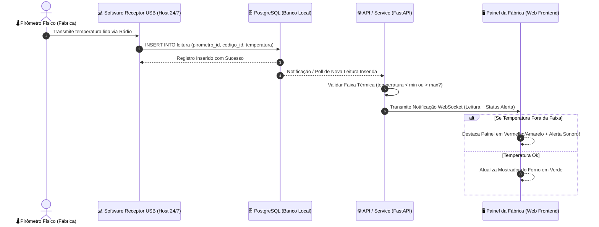

# 📐 Requisitos Funcionais, Não-Funcionais e Diagramas de Arquitetura (Ingestão Direta 24/7)

Este documento especifica os Requisitos Funcionais (RFs), Requisitos Não-Funcionais (RNFs), Diagramas de Casos de Uso e Diagramas de Sequência do sistema **Forno Fundição**, baseado em **Ingestão Direta no Banco via Receptor USB em Host 24/7**.

---

## 🎯 1. Requisitos Funcionais (RFs)

### 📋 Módulo de Ingestão e Equipamentos
*   **RF-01: Cadastro de Pirômetros**: O sistema deve permitir o cadastro e gerenciamento de pirômetros industriais (PIR-01 a PIR-04), vinculando-os ao seu setor, material alvo, processo e tipo de molde.
*   **RF-02: Tabela de Códigos por Equipamento**: O sistema deve permitir associar uma tabela de códigos numéricos (0 a 99) a cada pirômetro específico, definindo para cada código a etapa do processo e faixas de temperatura esperadas (`temp_min_esperada` e `temp_max_esperada`).
*   **RF-03: Ingestão Direta e Automática no Banco**: O software do receptor USB (instalado no PC Host 24/7) deve gravar diretamente no banco de dados PostgreSQL as medições recebidas dos pirômetros por sinal de rádio.

### 🌡️ Módulo de Rastreabilidade e Validação
*   **RF-04: Rastreabilidade e Enriquecimento Contextual**: O sistema deve permitir vincular as leituras capturadas automaticamente aos identificadores operacionais de **Corrida** (lote de fusão), **Lote** de peças e número da **Panela** (*ladle*).
*   **RF-05: Validação e Alerta Térmico em Tempo Real**: Ao detectar novas medições gravadas no banco, o sistema deve verificar se a temperatura está dentro dos limites cadastrados para aquele código/pirômetro. Se a temperatura estiver fora da faixa, o sistema deve emitir um **alerta visual/sonoro no painel em tempo real**.

### 📊 Módulo de Gestão e Consultas
*   **RF-06: Dashboards e Relatórios**: O sistema deve exibir um painel em tempo real da fábrica com o estado dos fornos e permitir consulta histórica de leituras com filtros por pirômetro, data, turno, corrida, lote ou operador.
*   **RF-07: Acompanhamento de Desgaste dos Cadinhos (Campanha do Forno)**: O sistema/processo deve permitir o registro e controle de medições de desgaste dos cadinhos para monitoramento da vida útil da campanha do forno.

---

## ⚡ 2. Requisitos Não-Funcionais (RNFs)

*   **RNF-01: Ingestão Automática de Baixa Latência**: As medições gravadas pelo software do receptor USB devem ser validadas e refletidas na interface do sistema em menos de 500ms.
*   **RNF-02: Imutabilidade dos Registros (Auditoria Industrial)**: Os registros de medição de temperatura (`Leitura`) são estritamente imutáveis. Não são permitidas operações de edição (`UPDATE`) ou remoção (`DELETE`) via API.
*   **RNF-03: Alta Disponibilidade 24/7 em Rede Local**: O servidor onde o receptor USB estiver plugado deve permanecer ligado e com o serviço ativo 24 horas por dia, 7 dias por semana, operando em rede local on-premises sem dependência de internet.
*   **RNF-04: Resiliência a Reinicializações**: O software do receptor USB e a API do sistema devem estar configurados como serviços de sistema (daemons/services) para subir automaticamente caso o computador host seja reiniciado.

---

## 🔄 3. Diagrama de Sequência — Ingestão Direta no Banco de Dados (24/7)

