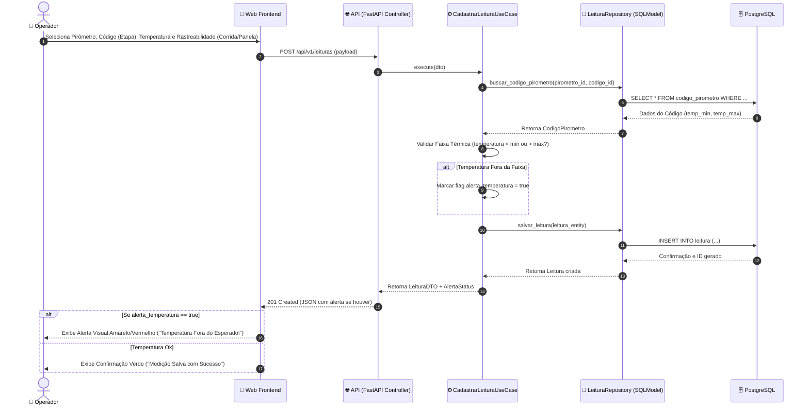
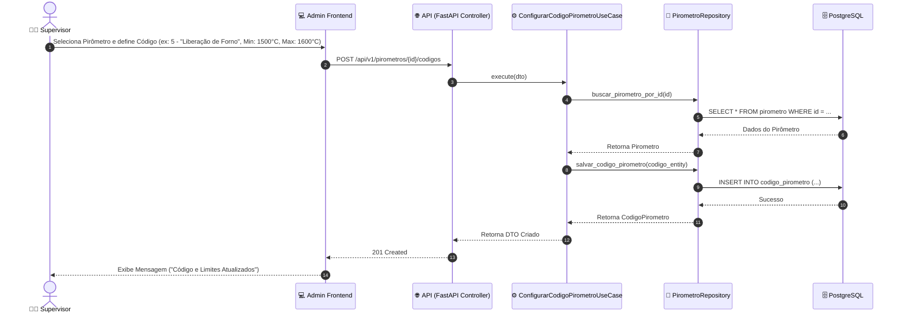

# 📐 Requisitos Funcionais, Não-Funcionais e Diagramas de Arquitetura

Este documento especifica os Requisitos Funcionais (RFs), Requisitos Não-Funcionais (RNFs), Diagramas de Casos de Uso e Diagramas de Sequência do sistema **Forno Fundição**.

---

## 🎯 1. Requisitos Funcionais (RFs)

### 📋 Módulo de Cadastro e Configuração
*   **RF-01: Cadastro de Pirômetros**: O sistema deve permitir o cadastro e gerenciamento de pirômetros industriais (ex: PIR-01 a PIR-04), vinculando-os ao seu setor, material alvo (ex: SAE 1045, Ferro Nodular), processo e tipo de molde.
*   **RF-02: Tabela de Códigos por Equipamento**: O sistema deve permitir associar uma tabela de códigos numéricos (0 a 99) a cada pirômetro específico, definindo para cada código o nome da etapa, descrição, ordenação e faixas de temperatura esperadas (`temp_min_esperada` e `temp_max_esperada`).

### 🌡️ Módulo de Apontamento e Validação
*   **RF-03: Apontamento Manual de Temperatura**: O sistema deve permitir que o operador registre uma medição informando o pirômetro, o código da etapa (0-99), a temperatura lida no mostrador e observações opcionais.
*   **RF-04: Rastreabilidade (Corrida, Lote e Panela)**: O sistema deve permitir vincular cada leitura a um identificador de **Corrida** (lote de fusão), **Lote** de peças e número da **Panela** (ladle).
*   **RF-05: Validação e Alerta Térmico em Tempo Real**: Ao registrar uma leitura, o sistema deve verificar se a temperatura informada está dentro dos limites térmicos cadastrados para aquele código/pirômetro. Se a temperatura estiver fora da faixa, o sistema deve emitir um **alerta visual** de advertência, **sem impedir o salvamento da medição**.

### 📊 Módulo de Gestão e Consultas
*   **RF-06: Relatórios de Leituras**: O sistema deve fornecer consulta histórica de leituras com filtros por pirômetro, data, turno, corrida, lote ou operador.
*   **RF-07: Acompanhamento de Desgaste dos Cadinhos (Campanha do Forno)**: O sistema/processo deve permitir o registro e controle de medições de desgaste dos cadinhos para monitoramento da vida útil da campanha do forno.

---

## ⚡ 2. Requisitos Não-Funcionais (RNFs)

*   **RNF-01: Desempenho e Latência**: A operação de registro de uma leitura pela API deve responder em menos de 500ms na rede local, garantindo fluidez na fábrica.
*   **RNF-02: Imutabilidade dos Registros (Auditoria Industrial)**: Os registros de medição de temperatura (`Leitura`) são estritamente imutáveis. Não são permitidas operações de edição (`UPDATE`) ou remoção (`DELETE`) via API. Erros de digitação são corrigidos através do lançamento de uma nova medição contendo observação justificativa.
*   **RNF-03: Operação Local On-Premises**: O sistema (Web App, API e Banco de Dados PostgreSQL) deve rodar 100% na rede local da fábrica da Rei Auto Parts, sem dependência de acesso à internet.
*   **RNF-04: Usabilidade e Acessibilidade Industrial**: A interface web deve ser responsiva, limpa e com botões de tamanho adequado para uso em ambiente de fábrica (tablets industriais e PCs locais com luvas/ambientes sujos).
*   **RNF-05: Arquitetura Extensível (Clean Architecture)**: O sistema deve seguir o padrão Clean Architecture, desacoplando o modelo de domínio das tecnologias de infraestrutura e banco de dados.

---

## 🎭 3. Diagrama de Casos de Uso

```mermaid
graph TD
    actorOperador["👷 Operador do Forno"]
    actorSupervisor["👨‍💼 Chefe / Supervisor"]
    
    subgraph SistemaFornoFundicao ["Sistema Forno Fundição"]
        UC01["UC01: Selecionar Pirômetro e Etapa (Código 0-99)"]
        UC02["UC02: Apontar Medição de Temperatura"]
        UC03["UC03: Informar Rastreabilidade (Corrida, Lote, Panela)"]
        UC04["UC04: Visualizar Alerta Térmico (Fora de Faixa)"]
        UC05["UC05: Consultar Histórico e Relatório de Leituras"]
        UC06["UC06: Configurar Códigos e Limites Térmicos"]
        UC07["UC07: Registrar Desgaste/Manutenção de Cadinho (Campanha)"]
    end

    actorOperador --> UC01
    actorOperador --> UC02
    actorOperador --> UC03
    UC02 ..> UC04 : <<include>>
    
    actorSupervisor --> UC05
    actorSupervisor --> UC06
    actorSupervisor --> UC07
```

---

## 🔄 4. Diagrama de Sequência — Apontamento Manual de Temperatura

Este diagrama ilustra o fluxo completo de registro de uma leitura de temperatura, desde a interação do operador no formulário até a gravação imutável no banco de dados com alerta visual.



---

## 🔄 5. Diagrama de Sequência — Cadastro de Limites Térmicos por Pirômetro

Este diagrama detalha como o Supervisor configura um novo código ou ajusta os limites térmicos de um pirômetro específico.


