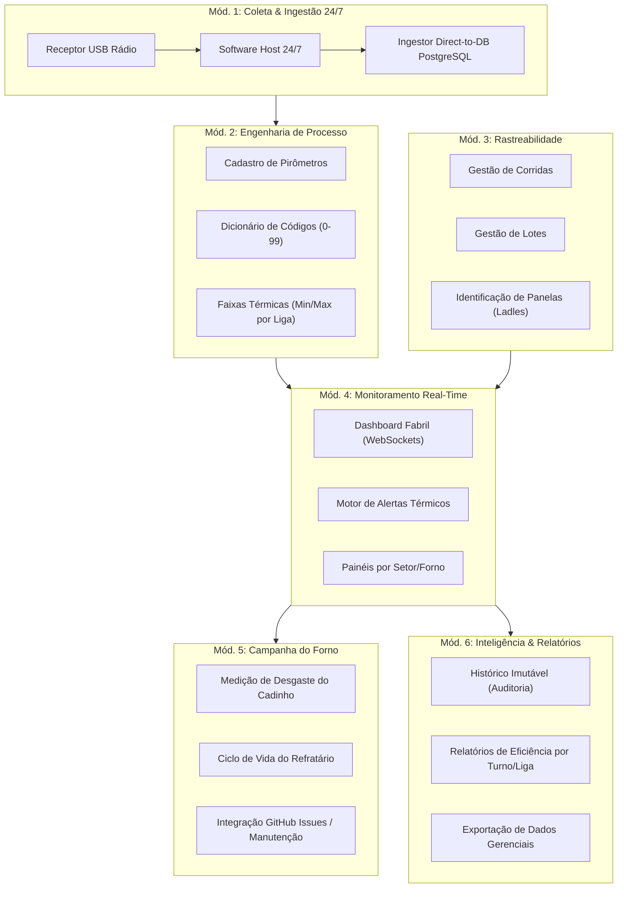

# 🗺️ Especificação Completa do Produto — Sistema Forno Fundição

Este documento fornece a **Visão Macro de 360° do Produto Completo**, mapeando todos os módulos, arquitetura de dados, fluxos operacionais, regras de negócio e planejamento estratégico antes da implementação do código.

---

## 🎯 1. Visão do Produto & Objetivo de Negócio

O **Forno Fundição** é um sistema de gestão operacional e monitoramento térmico em tempo real para a indústria metalúrgica **Rei Auto Parts**.

### Problemas Atuais Resolvidos pelo Sistema
1. **Fim do Apontamento Manual de Temperatura**: Captação 100% automática das temperaturas enviadas pelos pirômetros via rádio para um receptor USB em servidor 24/7.
2. **Eliminação de Ambiguidade dos Códigos 0-99**: Tradução dinâmica do número do pirômetro para a etapa metalúrgica real daquela liga/forno.
3. **Garantia de Qualidade e Redução de Refugo**: Emissão imediata de alertas visuais e sonoros quando uma medição foge da faixa térmica esperada.
4. **Rastreabilidade Fim-a-Fim**: Vínculo completo entre a medição da temperatura, a Corrida de fusão, o Lote de produção e a Panela (*ladle*) utilizada.
5. **Prevenção de Falhas Industriais**: Acompanhamento do desgaste dos cadinhos para gestão da **Campanha do Forno** e troca preventiva.

---

## 🧩 2. Mapeamento Completo de Módulos do Sistema



---

## 🔬 3. Detalhamento Funcional por Módulo

### Módulo 1: Coleta & Ingestão Automática (Host 24/7)
*   **Ingestão Direta no Banco**: Conexão nativa do software do receptor USB com a base PostgreSQL (porta 5432).
*   **Zero Digitação de Temperatura**: A medição emitida pelo pirômetro entra diretamente na tabela `leitura`.
*   **Watchdog de Conexão**: Monitoramento do status do receptor USB; alerta a equipe de TI caso a recepção fique inativa por mais de X minutos durante o turno.

### Módulo 2: Engenharia de Processo & Limites Térmicos
*   **Cadastro Flexível de Pirômetros**: Permite cadastrar novos pirômetros (PIR-01 a PIR-04 e futuros equipamentos de centrífugas) com setor, material alvo e tipo de molde.
*   **Tradutor de Códigos 0-99**: Tabela de etapas configurável por pirômetro. Exemplo:
    *   No PIR-01: Código `0` = *Liberação de Forno* (Faixa: 1520°C - 1560°C).
    *   No PIR-03: Código `0` = *Início de Vazamento* (Faixa: 1420°C - 1460°C).
*   **Validação Térmica Automática**: Comparação instantânea da temperatura capturada com `temp_min_esperada` e `temp_max_esperada`.

### Módulo 3: Rastreabilidade Industrial Avançada
*   **Associação de Corrida e Lote**: Interface de seleção rápida onde o operador/supervisor define a "Corrida Ativa" (lote de fusão) no forno.
*   **Identificação de Panelas (Ladles)**: Registro do identificador da panela (ex: Panela #1, #2, #3) usada para transportar o metal fundido.
*   **Vinculação de Operador/Turno**: Registro do responsável pela supervisão e operação durante a medição.

### Módulo 4: Monitoramento em Tempo Real & Alerta Fabril
*   **Painel da Fábrica (Dashboard Web)**: Exibição gráfica dos 4 fornos em telas/monitores no setor de fundição.
*   **Comunicação Via WebSockets/SSE**: Atualização instantânea sem necessidade de recarregar a página.
*   **Motor de Alerta Sonoro e Visual**:
    *   🟢 **Verde**: Temperatura dentro da faixa ideal.
    *   🟡 **Amarelo**: Advertência (aproximando do limite mínimo/máximo).
    *   🔴 **Vermelho**: Crítico (temperatura fora da faixa) + Sinal Sonoro para intervenção do operador.

### Módulo 5: Campanha do Forno & Desgaste de Cadinhos
*   **Registro de Desgaste**: Coleta e lançamento da espessura/condição do revestimento refratário do cadinho.
*   **Controle de Vida Útil**: Contagem acumulada de corridas/horas de operação por cadinho instalado.
*   **Prevenção de Desastres Industriais**: Notificação preventiva para troca antes de atingir o desgaste limite.
*   **Integração com GitHub Issues**: Abertura e acompanhamento de chamados de manutenção preventiva diretamente no repositório.

### Módulo 6: Inteligência Gerencial & Auditoria
*   **Imutabilidade Rígida (Zero UPDATE/DELETE)**: Garantia de auditoria industrial; leituras gravadas não podem ser alteradas. Correções são feitas via contra-lançamento com observação.
*   **Relatórios por Liga/Turno/Equipamento**: Gráficos de dispersão de temperatura, estabilidade da fusão e curva de aquecimento.
*   **Exportação de Dados**: Geração de arquivos formatados para relatórios da chefia/diretoria.

---

## 🏗️ 4. Arquitetura Tecnológica Macro

```
┌───────────────────────────────────────────────────────────────────────────┐
│                           CAMADA DE DISPOSITIVOS                          │
│  [PIR-01 Centrífuga] [PIR-02 Fundição Aço] [PIR-03 Ferro] [PIR-04 Ferro] │
└─────────────────────────────────────┬─────────────────────────────────────┘
                                      │ (Sinal Rádio 24/7)
                                      ▼
┌───────────────────────────────────────────────────────────────────────────┐
│                         CAMADA DE HOST & INGESTÃO                         │
│  [Servidor PC Host Local / Mini PC 24/7] ──► [Receptor USB]               │
│  [Software Gerenciador USB (Daemon/Service)]                              │
└─────────────────────────────────────┬─────────────────────────────────────┘
                                      │ (PostgreSQL Direct / SSL)
                                      ▼
┌───────────────────────────────────────────────────────────────────────────┐
│                         CAMADA DE BANCO DE DADOS                          │
│  [PostgreSQL 16 (Local ou VPS na Nuvem)]                                 │
│  - Tabelas: pirometro, codigo_pirometro, leitura, campanha_cadinho        │
└─────────────────────────────────────┬─────────────────────────────────────┘
                                      │
                                      ▼
┌───────────────────────────────────────────────────────────────────────────┐
│                           CAMADA DE APLICAÇÃO                             │
│  [FastAPI Backend + Clean Architecture]                                   │
│  - Core Domain & Use Cases                                                │
│  - Dependency Injector Container                                          │
│  - WebSocket / SSE Realtime Push Manager                                  │
└─────────────────────────────────────┬─────────────────────────────────────┘
                                      │
                                      ▼
┌───────────────────────────────────────────────────────────────────────────┐
│                           CAMADA DE APRESENTAÇÃO                          │
│  [Web App Responsivo (Fabril & Gerencial)]                                │
│  - Painel de Monitoramento da Fundição (TVs/Monitores)                    │
│  - Apontamento Rápido de Rastreabilidade (Tablets)                        │
│  - Gestão de Parâmetros e Relatórios (PC da Chefia)                       │
└───────────────────────────────────────────────────────────────────────────┘
```

---

## 🗺️ 5. Cronograma de Fases & Entregáveis (Roadmap)

### 🟢 Fase 1: MVP - Ingestão Automática, Rastreabilidade e API Core (Versão v0.1.0)
- [x] Modelagem de Dados SQLModel (`Pirometro`, `CodigoPirometro`, `Leitura`) + Alembic.
- [x] Arquitetura de Testes com >90% de Cobertura (`app/tests/`).
- [x] Especificação de Ingestão Direct-to-DB 24/7 e Guia de Setup USB.
- [ ] Implementação da Camada de Repositórios de Dados (`PirometroRepository`, `LeituraRepository`).
- [ ] Implementação dos Casos de Uso (`CadastrarLeituraUseCase`, `ProcessarValidaçãoTérmicaUseCase`).
- [ ] Desenvolvimento dos Endpoints REST na API.
- [ ] Integração com Rastreabilidade (Corrida, Lote, Panela).

### 🟡 Fase 2: Gestão da Campanha do Forno e Desgaste de Cadinhos (Versão v0.2.0)
- [ ] Modelagem da entidade `Cadinho` e `RegistroDesgasteCadinho`.
- [ ] Interface para acompanhamento da vida útil refratária do forno.
- [ ] Integração de Alertas de Manutenção Preventiva via GitHub Issues.

### 🔵 Fase 3: Dashboard em Tempo Real e Relatórios Gerenciais Fabris (Versão v1.0.0)
- [ ] Interface Web em Tempo Real (WebSockets) para Monitores/TVs da fábrica.
- [ ] Motor de Alertas Sonoros e Visuais em Tela.
- [ ] Módulo de Relatórios de Eficiência, Gráficos de Dispersão Térmica e Exportação.
