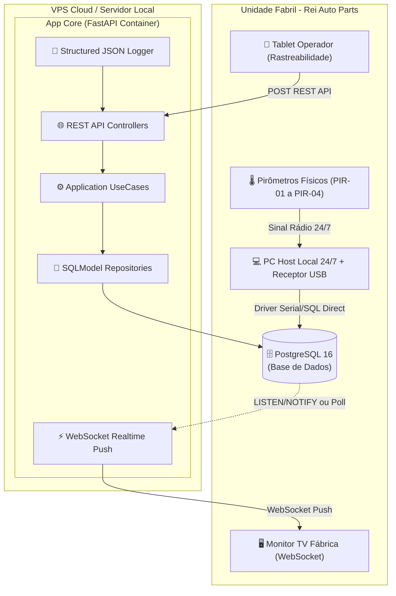
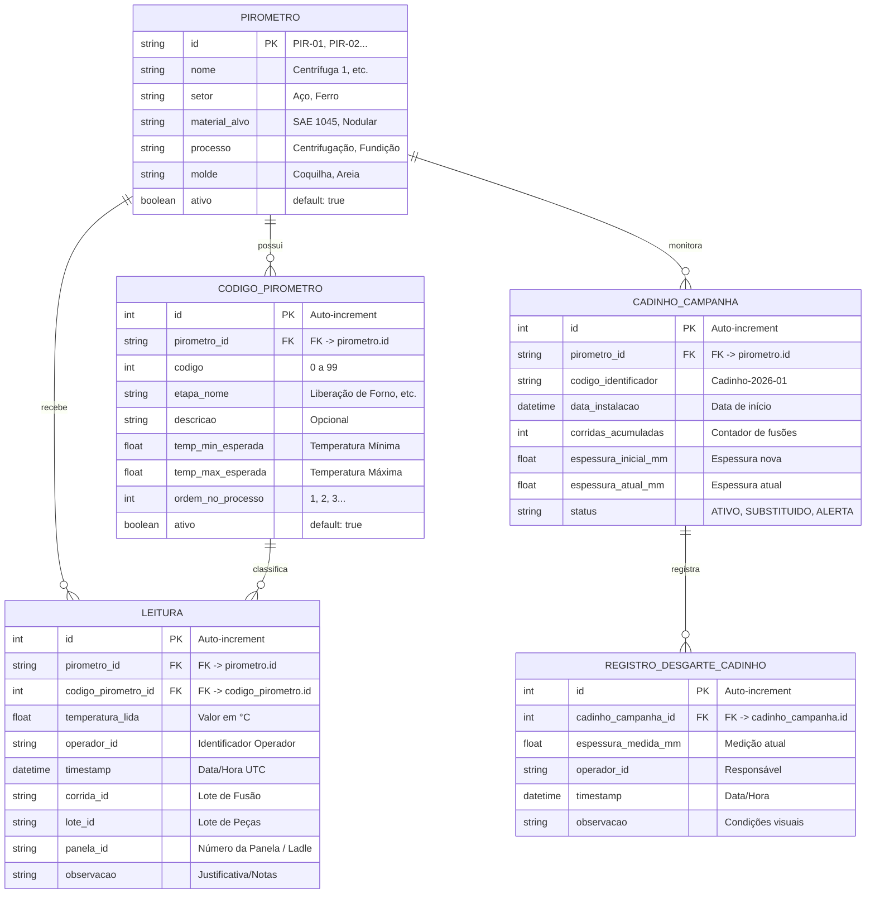

# 🏛️ System Design & Arquitetura de Engenharia — Forno Fundição

Este documento especifica o **System Design completo** do projeto **Forno Fundição**, abordando o planejamento de banco de dados (ERD e indexação), workflows de dados e operação, infraestrutura, ferramentas de desenvolvimento, observabilidade, logging e métricas industriais.

---

## 📐 1. System Design & Topologia da Solução

### Diagrama de Containers (C4 Model Level 2)



---

## 🗄️ 2. Planejamento do Banco de Dados (Database Design)

### Diagrama de Entidade-Relacionamento (ERD)



### Estratégia de Indexação e Desempenho (Indexes)
Para garantir consultas instantâneas no painel e relatórios gerenciais sem lentidão:
1. **Índice Composto por Equipamento e Timestamp**: `CREATE INDEX idx_leitura_pirometro_timestamp ON leitura (pirometro_id, timestamp DESC);`
2. **Índice de Rastreabilidade por Corrida e Lote**: `CREATE INDEX idx_leitura_corrida_lote ON leitura (corrida_id, lote_id);`
3. **Índice de Códigos Ativos**: `CREATE INDEX idx_codigo_pirometro_ativo ON codigo_pirometro (pirometro_id, codigo) WHERE ativo = true;`

---

## 🔄 3. Workflows de Dados & Operação

### Workflow A: Ingestão Automática e Disparo de Alerta Térmico
```
[Pirômetro Físico] ──(Rádio)──► [Receptor USB] ──(Driver SQL)──► [INSERT INTO leitura]
                                                                        │
                                                                        ▼
                                                             [Backend Service Listener]
                                                                        │
                                                              ┌─────────┴─────────┐
                                                              ▼                   ▼
                                                     [Busca Limites Código]  [Grava Log]
                                                              │
                                                     (Fora da Faixa?)
                                                      ├── SIM ──► Notifica WebSocket (Alerta Vermelho/Sonoro)
                                                      └── NÃO ──► Notifica WebSocket (Verde / Normal)
```

### Workflow B: Rastreabilidade (Vinculação de Corrida e Panela)
```
[Operador no Tablet] ──► Seleciona Forno PIR-01 ──► Define Corrida "CR-2026-88" & Panela "#3"
                                                                  │
                                                                  ▼
                                                      [API /api/v1/sessoes-forno]
                                                                  │
                                                                  ▼
                                         [Registra contexto ativo na memória do Ingestor]
                                                                  │
                                                                  ▼
                            [Novas leituras recebidas via USB herdam Corrida "CR-2026-88" e Panela "#3"]
```

---

## 🛠️ 4. Ferramentas de Desenvolvimento & Ambiente (DX)

*   **Ambiente Isolado (Devcontainer)**: `.devcontainer/` pré-configurado com Python 3.12, PostgreSQL 16 e dependências.
*   **Gestão de Tarefas (Makefile)**:
    *   `make install`: Cria venv e instala dependências.
    *   `make validate`: Executa `py_compile` + `black` + `isort` + `flake8` + `mypy` + `pytest` (exigindo **>90% de cobertura**).
    *   `make up`: Sobe container da API + PostgreSQL via Docker Compose.
    *   `make migrate`: Executa `alembic upgrade head`.
*   **Migrações de Banco (Alembic)**: Controle estrito de alterações de schema DDL com versionamento em código (`app/migrations/versions/`).

---

## 📊 5. Observabilidade, Logging e Métricas Industriais

### Formato de Log Estruturado (JSON)
Todos os componentes do sistema utilizam o logger unificado (`infra/tools/logger.py`), emitindo logs formatados em JSON para fácil agregação e auditoria:

```json
{
  "timestamp": "2026-07-20T03:08:00Z",
  "level": "WARN",
  "logger": "forno-fundicao",
  "event": "ALERTA_TEMPERATURA_FORA_DA_FAIXA",
  "pirometro_id": "PIR-01",
  "codigo": 5,
  "temperatura_lida": 1620.5,
  "temp_min_esperada": 1500.0,
  "temp_max_esperada": 1600.0,
  "corrida_id": "CR-2026-88",
  "panela_id": "P-03",
  "correlation_id": "req-98dc6b785c31"
}
```

### Métricas Industriais de Saúde (KPIs do Sistema)
1. **Ingestão Rate (Medições/Minuto)**: Volume de leituras capturadas por pirômetro.
2. **Taxa de Anomalias Térmicas (Alert Ratio)**: Porcentagem de leituras fora da faixa por turno/liga.
3. **Latência E2E de Ingestão**: Tempo decorrido desde a gravação do USB no PostgreSQL até a atualização da tela na fábrica (meta: `< 500ms`).
4. **Healthcheck Probes (`GET /health`)**:
   * Checagem de conectividade com o banco PostgreSQL.
   * Checagem de integridade do listener de recepção.
