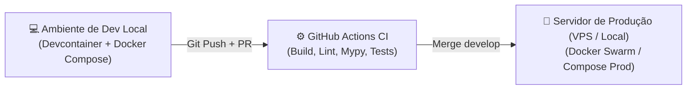

# 🌐 Arquitetura Macro, Fluxo Global do Sistema & Estratégia de Deploy

Este documento descreve a **Visão Global e Sistêmica do Forno Fundição**, detalhando como o sistema funciona de ponta a ponta, a lógica conceitual de banco de dados, como os componentes se conectam e a estratégia completa de deploy e infraestrutura sem focar em modelos de dados em código.

---

## 🔁 1. Fluxo Global do Sistema (System Lifecycle)

O sistema opera como um ecossistema distribuído de baixa latência em 5 etapas contínuas:

```
┌─────────────────────────────────────────────────────────────────────────────┐
│ 1. CAPTURA FÍSICA (FÁBRICA)                                                │
│ Operador mede com o Pirômetro ──(Sinal Rádio RF)──► Receptor USB            │
└──────────────────────────────────────┬──────────────────────────────────────┘
                                       │
                                       ▼
┌─────────────────────────────────────────────────────────────────────────────┐
│ 2. RECEPTOR & HOST LOCAL 24/7                                               │
│ Driver Serial ──► Software Gerenciador ──► Cliente SQL Direct (SSL/TLS)      │
└──────────────────────────────────────┬──────────────────────────────────────┘
                                       │
                                       ▼
┌─────────────────────────────────────────────────────────────────────────────┐
│ 3. BANCO DE DADOS (POSTGRESQL - LOCAL OU VPS)                               │
│ Recebe e grava a gravação física (Imutável) ──► Notifica Evento (Listen)    │
└──────────────────────────────────────┬──────────────────────────────────────┘
                                       │
                                       ▼
┌─────────────────────────────────────────────────────────────────────────────┐
│ 4. MOTOR DE REGRAS & BACKEND (FASTAPI)                                      │
│ Captura evento ──► Aplica regras de processo ──► Emite alerta se necessário │
└──────────────────────────────────────┬──────────────────────────────────────┘
                                       │
                                       ▼
┌─────────────────────────────────────────────────────────────────────────────┐
│ 5. APRESENTAÇÃO EM TEMPO REAL                                               │
│ Transmissão WebSocket ──► Monitores/TVs da Fábrica & Tablets de Operação     │
└─────────────────────────────────────────────────────────────────────────────┘
```

---

## 🗄️ 2. Lógica e Filosofia do Banco de Dados

### Estratégia de Persistência & Imutabilidade
*   **Audit Trail Industrial (Append-Only)**: O banco de dados é projetado sob o princípio da **imutabilidade de auditoria**. Registros térmicos nunca são alterados (`UPDATE`) ou apagados (`DELETE`). Toda nova leitura representa um fato físico irreversível que ocorreu na fábrica.
*   **Tratamento de Erros**: Erros operacionais (ex: leitura realizada no código incorreto) não modificam o dado original. O operador registra uma nova medição corretiva com notas explicativas.
*   **Estratégia de Resiliência & Connection Pooling**: O acesso ao PostgreSQL é gerenciado por Pool de Conexões assíncrono para suportar dezenas de conexões simultâneas da fábrica sem causar estouro de memória ou *lock* de tabelas.
*   **Política de Backup e Recuperação de Desastres (DRP)**:
    *   **Snapshots Diários**: Em ambiente VPS, snapshots automáticos da máquina inteira a cada 24h.
    *   **pg_dump Periódico**: Exportação automática agendada do banco de dados comprimido para um armazenamento secundário seguro.

---

## 🔌 3. Como as Coisas se Conectam (Protocolos e Integrações)

### Cadeia de Conectividade
1. **Pirômetro ──► Receptor USB**: Comunicação por rádio frequência proprietária (RF).
2. **Receptor USB ──► PC Host 24/7**: Comunicação Serial via driver de porta COM virtual (`/dev/ttyUSB0` ou `COM3`).
3. **PC Host ──► Banco PostgreSQL**: Conexão SQL criptografada via driver TCP/IP (Porta `5432` com protocolo TLS/SSL).
4. **PostgreSQL ──► Backend API**: Protocolo assíncrono PostgreSQL (drivers `asyncpg`/SQLModel) usando barramento de escuta de eventos (`LISTEN/NOTIFY`).
5. **Backend API ──► Web Frontend**: Protocolo **WebSockets (WSS)** para push bidirecional de baixa latência em tempo real para os monitores da fundição.

---

## 🚀 4. Estratégia de Deploy & CI/CD (Como Dar Deploy)

A estratégia de implantação foi desenhada para garantir **zero parada de fábrica (Zero Downtime)** durante atualizações.

### Ambientes de Execução



### Passo a Passo de Deploy em Produção

#### A. Deploy da Infraestrutura do Banco e API (Servidor/VPS)
1. **Containerização Uniforme**: A aplicação é empacotada via `Dockerfile` multi-stage em uma imagem leve e otimizada (Python Alpine/Slim).
2. **Orquestração via Docker Compose Production**:
   * O arquivo `docker-compose.prod.yml` gerencia o container do PostgreSQL e o container da API.
3. **Execução Automática de Migrações (Alembic)**:
   * Ao iniciar o container em produção, o script de bootstrap verifica a versão atual do banco e aplica novas migrações (`alembic upgrade head`) automaticamente antes de abrir a porta da API.

#### B. Deploy no PC Host 24/7 do Receptor USB (Fábrica)
1. O driver serial e o software gerenciador USB são instalados no PC Host 24/7.
2. O software é cadastrado como um **Serviço do Sistema Operacional** (Windows Service via NSSM ou Daemon Linux via `systemd`).
3. As credenciais do banco em produção (Host, Porta, Usuário, Senha) são salvas no serviço.

---

## 🛡️ 5. Governança de Manutenção e Atualizações

*   **Atualização de Código da API**: Feita via atualização de imagem Docker na VPS/Servidor. Como o banco é desacoplado, a atualização do backend leva menos de 5 segundos.
*   **Independência da Operação**: Se a API precisar ser reiniciada para uma atualização, o software do receptor USB no PC Host continua recebendo o rádio dos pirômetros e gravando no PostgreSQL normalmente sem perder nenhuma leitura.
