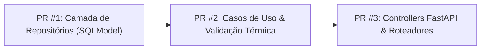

# 📌 Quadro do Projeto (Project Board) — Forno Fundição

Este documento organiza o backlog de tarefas, os PRs planejados e a execução do projeto **Forno Fundição**, alinhado ao Git Flow e ao GitHub Project V2 ([Visualizar no GitHub](https://github.com/users/OtavioProcopio/projects/3)).

---

## 💡 Como Ativar a Visualização em Quadro (Kanban) no GitHub

No link do projeto ([https://github.com/users/OtavioProcopio/projects/3](https://github.com/users/OtavioProcopio/projects/3)):
1. Clique no botão **`+`** (Adicionar Visualização) no canto superior esquerdo, ao lado de *View 1*.
2. Selecione a opção **`Board`**.
3. O GitHub automaticamente transformará a lista em colunas visuais estilo Kanban (**`Todo`**, **`In Progress`**, **`Done`**), permitindo arrastar os cards entre as colunas!

---

## 🗺️ Planejamento de PRs para a Fase 1 (MVP v0.1.0)

Dividimos as issues da Fase 1 em **3 Pull Requests incrementais**:

---

### 📦 PR #1 (Infra / Data Access Layer): `feat/repositories-pirometro-leitura`
*   **Issues Relacionadas**: [#3](https://github.com/OtavioProcopio/FornoFundicao/issues/3) (`feat: [INFRA] Repositórios Concretos`)
*   **Tarefas de Código**:
    *   [x] Definir `IPirometroRepository` e `ILeituraRepository` na camada de interfaces (`app/core/interfaces/adapters/repositories/`).
    *   [x] Implementar `PirometroRepository` e `LeituraRepository` usando SQLModel em `app/adapter/repositories/`.
    *   [x] Escrever testes unitários/integração dos repositórios em `app/tests/adapter/repositories/`.
*   **Status**: Concluído no PR #22.

---

### ⚙️ PR #2 (Application Layer / Business Logic): `feat/use-cases-cadastrar-listar-leitura`
*   **Issues Relacionadas**: [#4](https://github.com/OtavioProcopio/FornoFundicao/issues/4) (`Casos de Uso Core`) e [#13](https://github.com/OtavioProcopio/FornoFundicao/issues/13) (`Ingestor e Validação Térmica em Tempo Real`)
*   **Tarefas de Código**:
    *   [x] Criar `VincularContextoLeituraUseCase` em `app/core/application/use_cases/` (atualiza dados de rastreabilidade).
    *   [x] Criar `ObterLeiturasProcessadasUseCase` em `app/core/application/use_cases/` (traduz códigos e valida faixas térmicas).
    *   [x] Escrever testes de unidade dos casos de uso em `app/tests/core/application/`.
*   **Status**: Concluído no PR #22.

---

### 🌐 PR #3 (Controllers & API Bootstrap): `feat/api-controllers-pirometros-leituras`
*   **Issues Relacionadas**: [#5](https://github.com/OtavioProcopio/FornoFundicao/issues/5) (`Endpoints de Controle`) e [#11](https://github.com/OtavioProcopio/FornoFundicao/issues/11) (`Rastreabilidade de Corridas e Panelas`)
*   **Tarefas de Código**:
    *   [x] Criar `PirometroController` e `LeituraController` em `app/adapter/controllers/`.
    *   [x] Registrar injeção de dependências no contêiner `infra/config/container.py`.
    *   [x] Expor as rotas REST em `api.py` (`GET /api/v1/pirometros`, `PATCH /api/v1/leituras/{id}`, etc.).
    *   [x] Escrever testes de integração de API em `app/tests/api/`.
*   **Status**: Concluído no PR #24.

---

## 📋 Quadro Kanban do Projeto

### 🟢 Concluído (Done)
| Issue | Categoria | Descrição | Merge / Commit |
|---|---|---|---|
| **#1** | `feat` | API mínima FastAPI com `/health` e CI/CD. | PR #1 |
| **#2** | `feat` | Modelos de banco SQLModel (`Pirometro`, `CodigoPirometro`, `Leitura`) + Alembic. | PR #15 (Closes #2) |
| **#3** | `infra` | Repositórios concretos de dados em `adapter/repositories/`. | PR #22 (Closes #3) |
| **#4** | `feat` | Casos de uso core para processar leituras e associar contexto. | PR #22 |
| **#5** | `feat` | Endpoints REST de controle para pirômetros, etapas e leituras. | PR #24 (Closes #5) |
| **#6** | `test` | Suíte de testes em `app/tests/` (Clean Arch) com 99.03% cobertura. | PR #14 (Closes #6) |
| **#10** | `docs` | Requisitos, diagramas de sequência, especificação Direct-to-DB e guia do receptor USB 24/7. | PR #16 (Closes #10) |
| **#11** | `arch` | Rastreabilidade de corridas, lotes e panelas (ladles) via PATCH. | PR #24 (Closes #11) |
| **#13** | `feat` | Ingestão e processamento de leituras com tradução automática. | PR #22 |
