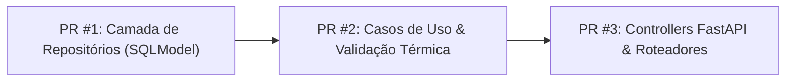

# 📌 Quadro do Projeto (Project Board) — Forno Fundição

Este documento organiza o backlog de tarefas, os PRs planejados e a execução do projeto **Forno Fundição**, alinhado ao Git Flow e ao GitHub Project V2 ([Visualizar no GitHub](https://github.com/users/OtavioProcopio/projects/3)).

---

## 💡 Como Ativar a Visualização em Quadro (Kanban) no GitHub

No link do projeto ([https://github.com/users/OtavioProcopio/projects/3](https://github.com/users/OtavioProcopio/projects/3)):
1. Clique no botão **`+`** (Adicionar Visualização) no canto superior esquerdo, ao lado de *View 1*.
2. Selecione a opção **`Board`**.
3. O GitHub automaticamente transformará a lista em colunas visuais estilo Kanban (**`Todo`**, **`In Progress`**, **`Done`**), permitindo arrastar os cards entre as colunas!

---

## 🗺️ Planejamento de PRs para a Fase 1 (MVP v0.1.0)

Dividimos as issues da Fase 1 em **3 Pull Requests incrementais**:

---

### 📦 PR #1 (Infra / Data Access Layer): `feat/repositories-pirometro-leitura`
*   **Issues Relacionadas**: [#3](https://github.com/OtavioProcopio/FornoFundicao/issues/3) (`feat: [INFRA] Repositórios Concretos`)
*   **Tarefas de Código**:
    *   [x] Definir `IPirometroRepository` e `ILeituraRepository` na camada de interfaces (`app/core/interfaces/adapters/repositories/`).
    *   [x] Implementar `PirometroRepository` e `LeituraRepository` usando SQLModel in `app/adapter/repositories/`.
    *   [x] Escrever testes unitários/integração dos repositórios em `app/tests/adapter/repositories/`.
*   **Status**: Concluído no PR #22.

---

### ⚙️ PR #2 (Application Layer / Business Logic): `feat/use-cases-cadastrar-listar-leitura`
*   **Issues Relacionadas**: [#4](https://github.com/OtavioProcopio/FornoFundicao/issues/4) (`Casos de Uso Core`) e [#13](https://github.com/OtavioProcopio/FornoFundicao/issues/13) (`Ingestor e Validação Térmica em Tempo Real`)
*   **Tarefas de Código**:
    *   [x] Criar `VincularContextoLeituraUseCase` em `app/core/application/use_cases/` (atualiza dados de rastreabilidade).
    *   [x] Criar `ObterLeiturasProcessadasUseCase` em `app/core/application/use_cases/` (traduz códigos e valida faixas térmicas).
    *   [x] Escrever testes de unidade dos casos de uso em `app/tests/core/application/`.
*   **Status**: Concluído no PR #22.

---

### 🌐 PR #3 (Controllers & API Bootstrap): `feat/api-controllers-pirometros-leituras`
*   **Issues Relacionadas**: [#5](https://github.com/OtavioProcopio/FornoFundicao/issues/5) (`Endpoints de Controle`) e [#11](https://github.com/OtavioProcopio/FornoFundicao/issues/11) (`Rastreabilidade de Corridas e Panelas`)
*   **Tarefas de Código**:
    *   [x] Criar `PirometroController` e `LeituraController` em `app/adapter/controllers/`.
    *   [x] Registrar injeção de dependências no contêiner `infra/config/container.py`.
    *   [x] Expor as rotas REST em `api.py` (`GET /api/v1/pirometros`, `PATCH /api/v1/leituras/{id}`, etc.).
    *   [x] Escrever testes de integração de API em `app/tests/api/`.
*   **Status**: Concluído no PR #24.

---

### 📊 PR #4 (Dashboard Core Metrics): `feat/dashboard-metrics-and-endpoints`
*   **Tarefas de Código**:
    *   [x] Criar `GerarDadosDashboardUseCase` com métricas consolidadas em 3 níveis (Operacional, Qualidade e Gerencial).
    *   [x] Criar `DashboardController` e expor rota `GET /api/v1/dashboard`.
    *   [x] Registrar injeção e realizar fiação na API.
    *   [x] Escrever testes de unidade e integração.
*   **Status**: Concluído no PR #26.

---

### ⚡ PR #5 (Real-time WebSockets & Background DB Monitor): `feat/websocket-realtime-broadcast`
*   **Tarefas de Código**:
    *   [x] Criar `WebSocketManager` em `app/infra/tools/websocket_manager.py` para gerenciamento de conexões ativas.
    *   [x] Implementar `monitor_database` em `app/infra/tools/db_monitor.py` para capturar novas leituras e transmitir via WebSocket.
    *   [x] Expor endpoint `/api/v1/leituras/ws` no `LeituraController`.
    *   [x] Registrar rotina background na inicialização (`startup`) da API.
    *   [x] Criar suíte de testes de transmissão em tempo real em `app/tests/api/test_websocket.py`.
*   **Status**: Concluído na branch `feat/websocket-realtime-broadcast`.

---

### 🔥 PR #6 (Fase 2: Gestão da Campanha do Forno e Desgaste de Cadinhos): `feat/gestao-campanha-cadinho`
*   **Tarefas de Código**:
    *   [x] Definir modelos SQLModel `Cadinho` e `RegistroDesgasteCadinho` em `app/core/domain/models.py`.
    *   [x] Criar migration Alembic `a1b2c3d4e5f6_add_cadinho_and_desgaste_tables.py` em `app/migrations/versions/`.
    *   [x] Definir interface `ICadinhoRepository` e repositório concreto `CadinhoRepository`.
    *   [x] Criar casos de uso `CadastrarCadinhoUseCase`, `RegistrarDesgasteCadinhoUseCase` e `ObterStatusCampanhaUseCase`.
    *   [x] Criar `CadinhoController` (`POST /api/v1/cadinhos`, `GET /api/v1/cadinhos`, `POST /api/v1/cadinhos/{id}/desgaste`).
    *   [x] Escrever testes unitários e de integração em `app/tests/`.
*   **Status**: Concluído na branch `feat/gestao-campanha-cadinho`.

---

### 🏭 PR #7 (Entidade Forno & Gestão Multi-Cadinhos até 4 unidades): `feat/entidade-forno-e-gestao-multicadinho`
*   **Tarefas de Código**:
    *   [x] Criar entidade SQLModel `Forno` em `app/core/domain/models.py` com suporte a relacionamentos de pirômetros e cadinhos.
    *   [x] Atualizar `Cadinho` com campos `forno_id` e `posicao_no_forno` (posições 1 a 4).
    *   [x] Criar migration Alembic `b2c3d4e5f6a7_add_forno_entity_and_cadinho_relations.py`.
    *   [x] Criar interface `IFornoRepository` e repositório concreto `FornoRepository`.
    *   [x] Implementar casos de uso `CadastrarFornoUseCase`, `GerenciarCadinhosFornoUseCase` (com trava de limite máximo de 4 cadinhos por forno e posições livres), e `ListarFornosECadinhosUseCase`.
    *   [x] Criar `FornoController` (`POST /api/v1/fornos`, `GET /api/v1/fornos`, `POST /api/v1/fornos/{id}/cadinhos`, `PUT`, `DELETE`).
    *   [x] Escrever testes unitários e de integração em `app/tests/`.
*   **Status**: Concluído na branch `feat/entidade-forno-e-gestao-multicadinho`.

---

## 📋 Quadro Kanban do Projeto

### 🟢 Concluído (Done)
| Issue | Categoria | Descrição | Merge / Commit |
|---|---|---|---|
| **#1** | `feat` | API mínima FastAPI com `/health` e CI/CD. | PR #1 |
| **#2** | `feat` | Modelos de banco SQLModel (`Pirometro`, `CodigoPirometro`, `Leitura`) + Alembic. | PR #15 (Closes #2) |
| **#3** | `infra` | Repositórios concretos de dados em `adapter/repositories/`. | PR #22 (Closes #3) |
| **#4** | `feat` | Casos de uso core para processar leituras e associar contexto. | PR #22 |
| **#5** | `feat` | Endpoints REST de controle para pirômetros, etapas e leituras. | PR #24 (Closes #5) |
| **#6** | `test` | Suíte de testes em `app/tests/` (Clean Arch) com 99.03% cobertura. | PR #14 (Closes #6) |
| **#7** | `feat` | Gestão da Campanha do Forno e Medição de Desgaste Refratário de Cadinhos. | `feat/gestao-campanha-cadinho` |
| **#8** | `feat` | Entidade dedicada `Forno` e gestão multi-cadinhos (até 4 posições independentes por forno). | `feat/entidade-forno-e-gestao-multicadinho` |
| **#10** | `docs` | Requisitos, diagramas de sequência, especificação Direct-to-DB e guia do receptor USB 24/7. | PR #16 (Closes #10) |
| **#11** | `arch` | Rastreabilidade de corridas, lotes e panelas (ladles) via PATCH. | PR #24 (Closes #11) |
| **#13** | `feat` | Ingestão e processamento de leituras com tradução automática. | PR #22 |
| **#14** | `feat` | Dashboard API unificada servindo métricas operacionais, de qualidade e gerenciais. | PR #26 |
| **#15** | `feat` | Transmissão em tempo real via WebSockets (`/api/v1/leituras/ws`) e monitor de banco. | `feat/websocket-realtime-broadcast` |
